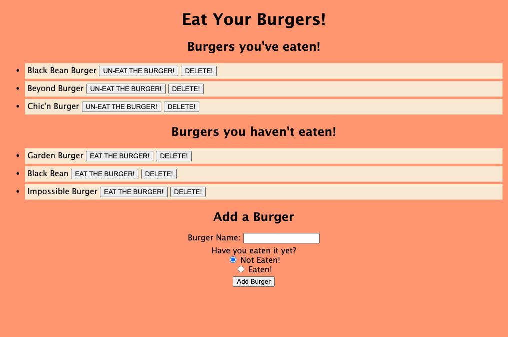
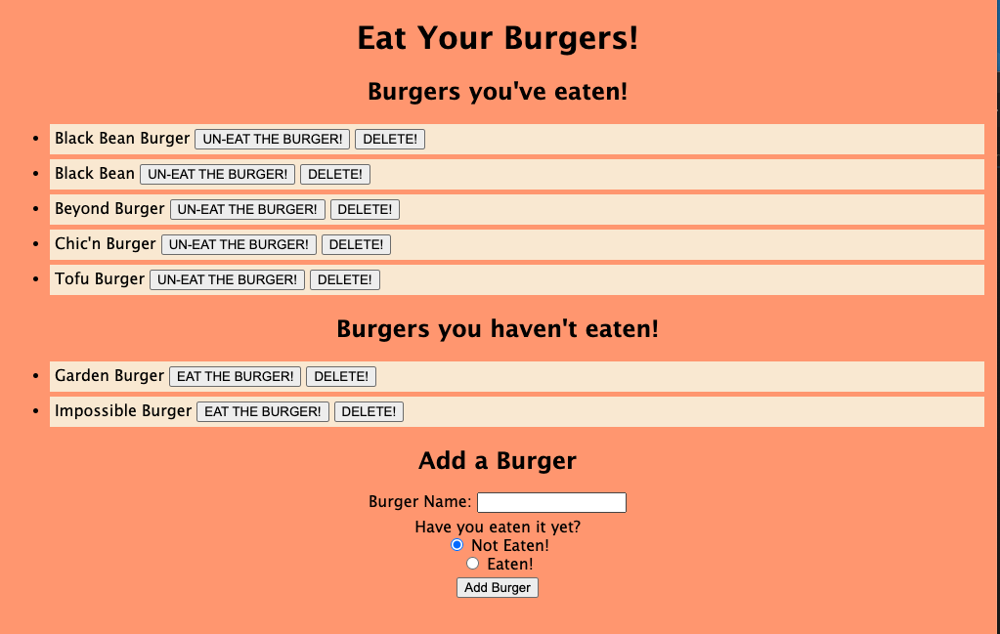

# Node Express Handlebars

## What, Why, and How
With this assignment, I was motivated to test out my new skills with Handlebars. It was a lot trickier than I anticipated it would be. We were told that the final result should be similar to an activity we did called CatsApp, which is Activity 17 in Unit 13. While it was extremely similar, and while I leaned heavily on that activity to help me figure out this homework assignment, there were some key differences that required an understanding of how all the files interact with eachother and how Handlebars works. It wasn't enough to simply copy and paste. While the structure was useful to copy, the actual content and references had to be changed in order to fit the content of this assignment. It was difficult at times, and I got a lot of bugs that took me several hours to debug, but I'm happy with the end result. And as a nice bonus, because I referenced the Cats activity, I was able to include a "Delete Burger" functionality in the application.
To achieve the end result of this application, I:
1. Created all the appropriate folders and files, making sure that they all referenced each other correctly (definitely ran into some difficulty here)
2. Made sure everything was routed correctly
3. Made sure I was using Handlebars to correctly reference the objects I had created to be inserted into the database

As I said, I'm happy with the end result, but I still feel as though I have a ways to go when it comes to properly understanding the material. There's still several lines of code I don't really have a firm grasp on, so I need to make sure to review this further in order to widen and solidify my understanding of the topics.

# Links
Link to GitHub repo: https://github.com/andrew1835/Node_Express_Handlebars
 
Link to Heroku: https://gentle-everglades-70718.herokuapp.com/

# Screenshots
This first screenshot shows an assortment of burgers, with some being in the "Burgers you've eaten" category, and some being in the "Burgers you haven't eaten" category:

 

This second screenshot shows what happens when I add a "Tofu Burger" to the "Burgers you've eaten" category, and when I've pressed "EAT THAT BURGER!" on the Black Bean burger

 